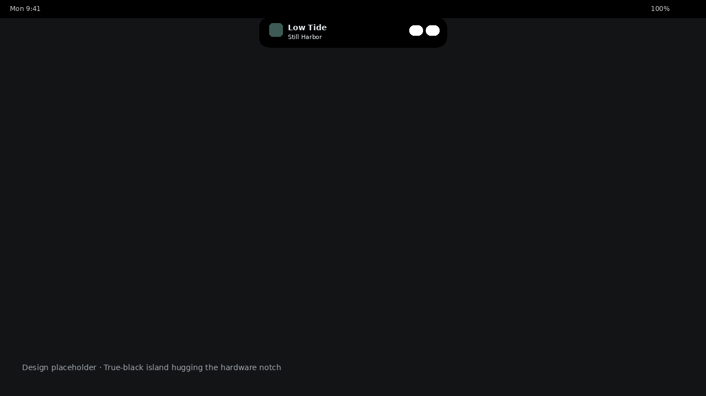
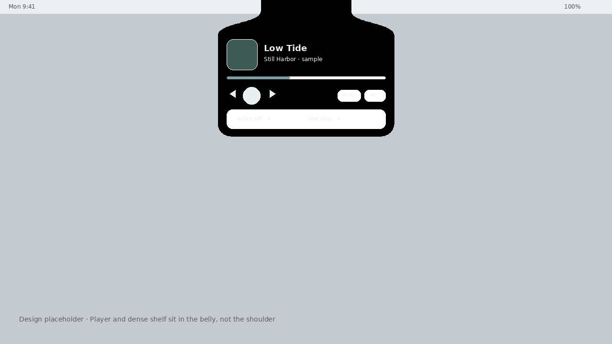
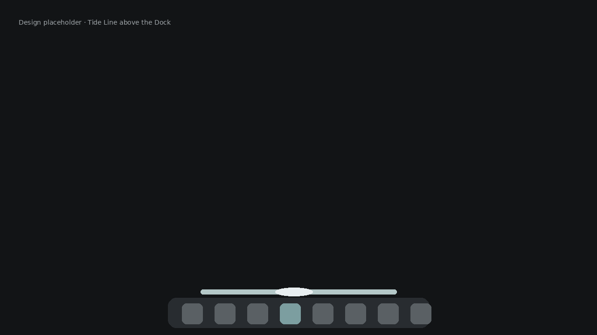
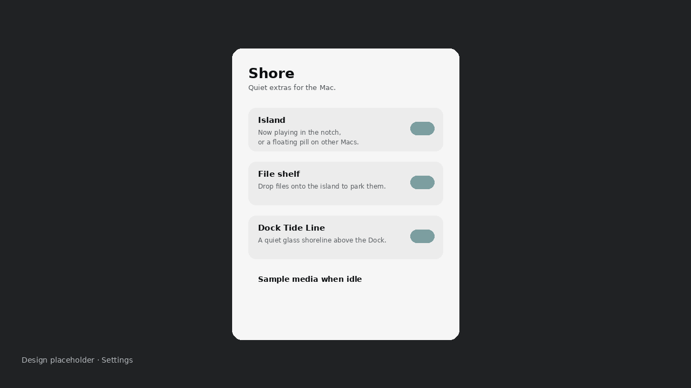

# Shore

Free, native **macOS** extras: a Dynamic Island–style notch (or floating pill) and a quiet Dock companion. One app, two optional modules, designed to stay out of the way.

Shore is **not** a feature dump, a Dock reskin, or an Electron wrapper. v1 is beauty-first: now-playing, a couple of live chips, and a shoreline above the Dock.

## Download

When a Mac-built disk image is published, get it from **[GitHub Releases](https://github.com/realvaleh/Shore/releases)**:

1. Open the latest release.
2. Download the `Shore-*.dmg` asset (Apple Silicon `arm64` unless the notes say otherwise).
3. Open the DMG and drag **Shore** to **Applications**.

No release asset yet means the binary has not been produced on a Mac. This repo is the source; Linux CI and Cursor Cloud VMs cannot run Xcode. Build locally (below) or wait for a maintainer to attach `dist/Shore-*.dmg` from `scripts/package-dmg.sh`.

### Gatekeeper (unsigned / ad-hoc v1)

Until Shore is Developer ID signed and notarized, macOS will say the app can’t be opened because it is from an unidentified developer.

Honest bypass for a build **you compiled yourself** or downloaded from this GitHub project:

1. Right-click Shore.app → **Open** → **Open**.
2. Or: System Settings → Privacy & Security → **Open Anyway**.

Do not disable Gatekeeper globally. Do not `xattr -cr` random downloads from the internet.

## What Shore is

- A menu-bar utility (`LSUIElement`) with no Dock icon of its own
- **Island** — now-playing that hugs a notched MacBook camera housing, or a floating pill on other displays. Hover expands instantly from the notch; click pins the player.
- **File shelf** — optional tray on the island: drop files to park them, drag them out later
- **Tide Line** — a click-through glass line that sits above the system Dock
- Settings to enable or disable each module independently
- On-device only. No account, no analytics, no network requirement

## What Shore isn’t

- Not a clone of Atoll, Boring Notch, Notchy, Droppy, or other island/dock apps
- Not a replacement for the macOS Dock, and not a cartoon skin over app icons
- Not an App Store build yet (sandbox is off so MediaRemote now-playing can work)
- Not signed/notarized in v1 — Gatekeeper will warn until you sign it yourself

Free island apps already exist. Shore’s wedge is **Island + Dock together**, kept quiet, kept original, kept free.

## Architecture

```
Shore.app (SwiftUI, macOS 14+, Swift 6)
├── Menu bar extra + Settings window
├── ShoreSettings          island / file-shelf / dock / sample-media toggles
├── ShoreRuntime           starts and tears down modules
├── Island module
│   ├── OverlayPanel       interactive, notch-aware placement, chrome-only hit testing
│   ├── NowPlayingStore    MediaRemote (dlopen) → sample/idle fallback
│   ├── LiveChipStore      battery (IOKit) + volume (CoreAudio)
│   └── FileShelfStore     optional drop/drag file parking
└── Dock module
    └── Tide Line panel    click-through hover polish above a bottom Dock
```

| Module | Behavior |
| --- | --- |
| Island | Resting chrome is flush to the hardware notch (bezel black, no gap). Hover morphs one elastic lip from the housing — same spring in and out, not a cross-fade. Click pins the player. Explicit collapse (chevron) ignores hover until the pointer leaves, so it does not bounce back open. Titles marquee instead of clipping into “Still Mar…”. Transparent panel wings stay click-through. |
| File shelf | Optional. Drop files onto the expanded island to park them, drag tokens back out. Independent settings toggle. |
| Tide Line | A short glass capsule above a **bottom** Dock. Mouse nearby lights a foam highlight. The panel ignores mouse events so Dock clicks pass through. Hidden when the Dock is on a side or auto-hidden to nothing. |
| Settings | Independent toggles. Optional sample track (“Low Tide”) when MediaRemote is empty — useful on Linux-less design machines and when nothing is playing. |

MediaRemote is a private Apple framework. Shore loads it at runtime and falls back if symbols are missing or now-playing is empty. That path cannot be exercised on Linux CI.

Apple Silicon is the v1 target (`ARCHS=arm64` in the DMG script). Intel is a Universal extra: in Xcode set Architectures to `arm64 x86_64`, or pass `ARCHS='arm64 x86_64'` to `scripts/package-dmg.sh`.

## Design

Original **tidal glass** language — wet-stone fill, bezel-black notch hug, sea-glass accent, rounded SF. The island uses one elastic shape morph for expand and collapse (Reduce Motion shortens it and stills the waveform).

Design placeholders (not live Mac screenshots):









Replace these with real captures from Xcode once you build on a Mac.

## Requirements

- macOS 14 Sonoma or later
- Xcode 16 or Xcode-beta (Swift 6)
- Apple Silicon recommended; Intel possible as noted above

## Build (Mac)

```bash
git clone https://github.com/realvaleh/Shore.git
cd Shore
open Shore.xcodeproj
```

1. Select the **Shore** target → Signing & Capabilities.
2. Set your Team, or keep ad-hoc (`CODE_SIGN_IDENTITY = "-"`) for local runs.
3. Run (⌘R). Shore appears in the menu bar as a water-waves icon.

Command line:

```bash
xcodebuild \
  -project Shore.xcodeproj \
  -scheme Shore \
  -configuration Debug \
  -destination 'platform=macOS' \
  CODE_SIGN_IDENTITY="-" \
  build
```

The app is an agent: look in the menu bar, not the Dock. Open **Settings…** from the extra, or press ⌘, when Shore is active.

## Install from a DMG

On a Mac, after a successful Release build:

```bash
chmod +x scripts/package-dmg.sh
./scripts/package-dmg.sh
```

That writes `dist/Shore-1.0.dmg` (Apple Silicon, version from `MARKETING_VERSION`). Override architecture with `ARCHS='arm64 x86_64' ./scripts/package-dmg.sh`. Open the DMG, drag **Shore** to **Applications**.

To publish a downloadable build, attach that DMG to a [GitHub Release](https://github.com/realvaleh/Shore/releases).

### Notarization (later)

v1 does not notarize. When you have a Developer ID:

```bash
xcrun notarytool submit dist/Shore-1.0.dmg --keychain-profile <profile> --wait
xcrun stapler staple dist/Shore-1.0.dmg
```

Sandbox is currently **off** (`Shore.entitlements`) so MediaRemote can see now-playing. Revisit sandbox before any App Store submission.

## Layout

```
Shore.xcodeproj          Xcode 16 / Swift 6 project / shared scheme
Shore/
  App/                   @main, delegate, runtime, settings store
  Design/                palette, motion, pill chrome
  Island/                panel, views, now-playing, chips, file shelf
  Dock/                  Tide Line companion
  Settings/              module toggles
  Support/               overlay NSPanel, screen / notch geometry
  Assets.xcassets
scripts/
  package-dmg.sh         Mac-only Release → dist/Shore-*.dmg
  validate-scaffold.py   Linux-safe structure check
  generate-assets.py     icon + placeholder screenshots
```

## License

[MIT](LICENSE) © 2026 Valeh
