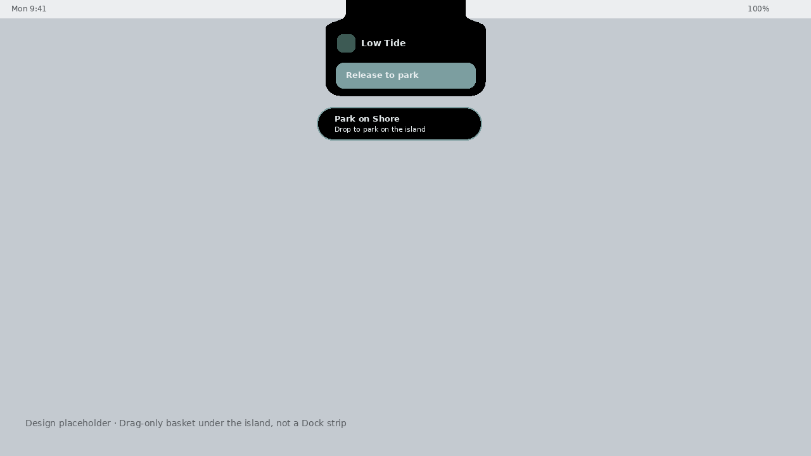

# Shore

Free, native **macOS** extras: a Dynamic Island–style notch (or floating pill) with file parking on the island. One app, optional modules, designed to stay out of the way.

Shore is **not** a feature dump, a Dock reskin, or an Electron wrapper. v1 is beauty-first: now-playing that looks like hardware, live chips that do something, and a file shelf that only shows up when you ask for it.

## Download

When a Mac-built disk image is published, get it from **[GitHub Releases](https://github.com/realvaleh/Shore/releases)**:

1. Open the latest release.
2. Download the `Shore-*.dmg` asset (Apple Silicon `arm64` unless the notes say otherwise).
3. Open the DMG and drag **Shore** to **Applications**.

No release asset yet means the binary has not been produced on a Mac. This repo is the source; Linux CI and Cursor Cloud VMs cannot run Xcode. Build locally (below) or wait for a maintainer to attach `dist/Shore-*.dmg` from `scripts/package-dmg.sh`.

### Gatekeeper (unsigned / ad-hoc v1)

Until Shore is Developer ID signed and notarized, macOS will say the app can’t be opened because it is from an unidentified developer.

Honest bypass for a build **you compiled yourself** or downloaded from this GitHub project:

1. Right-click Shore.app → **Open** → **Open**.
2. Or: System Settings → Privacy & Security → **Open Anyway**.

Do not disable Gatekeeper globally. Do not `xattr -cr` random downloads from the internet.

## What Shore is

- A menu-bar utility (`LSUIElement`) with no Dock icon of its own
- **Island** — now-playing that rests as the camera housing in true `#000000`, or a floating pill on other displays. Hover grows one capsule from that housing (art, title, waveform); click pins the player; click outside dismisses.
- **File shelf** — park files on the island. Drag onto the notch and the shelf shows a clear drop target; tokens have icons, a remove button, and drag back out. A small basket appears **only while a file drag is in flight** (near the pointer, or just under the island), then vanishes.
- Settings to enable or disable the island and the file shelf independently
- On-device only. No account, no analytics, no network requirement

## What Shore isn’t

- Not a clone of Atoll, Boring Notch, Notchy, Droppy, or other island/dock apps
- Not a replacement for the macOS Dock, and not a cartoon skin over app icons
- Not an always-on dashed tray above the Dock
- Not an App Store build yet (sandbox is off so MediaRemote now-playing can work)
- Not signed with a Developer ID, and not notarized — Gatekeeper will warn until you sign it yourself
- Not a finished silhouette or shelf. The housing-neck capsule and drag-time shelf are in the tree; spacing, shoulder, and shelf density still need polish

Free island apps already exist. Shore’s wedge is a camera-housing island with file parking that only appears when it is useful, kept original, kept free. The housing-neck silhouette and the shelf are better than the earlier T-bar and Dock Cove, and they are still an alpha — not commercial island-app polish.

## Architecture

```
Shore.app (SwiftUI, macOS 14+, Swift 6)
├── Menu bar extra + Settings window
├── ShoreSettings          island / file-shelf / sample-media toggles
├── ShoreRuntime           starts and tears down modules
├── Island module
│   ├── OverlayPanel       interactive, notch-aware placement, chrome-only hit testing
│   ├── NowPlayingStore    MediaRemote (dlopen) → sample/idle fallback
│   ├── LiveChipStore      battery (IOKit) + volume mute/drag (CoreAudio)
│   └── FileShelfStore     drop/drag file parking on the island
└── Drag basket
    └── Appears only while a file drag is in flight (near cursor / notch)
```

| Module | Behavior |
| --- | --- |
| Island | Rest covers the hardware notch (`#000000`, flush top, rounded chin, no stroke or shadow). Hover and pin morph **one** path: the top stays housing-width, a cubic shoulder swells into the belly, the bottom stays a squircle. Compact is a single capsule (art + title + waveform). Click pins the player (art, title, seek, controls). Chips sit on the transport row, never on the title. Click outside collapses. Explicit collapse (chevron) ignores hover until the pointer leaves. Hit-testing follows the silhouette so menu-bar items beside the notch stay clickable. |
| File shelf | Island tray. A dashed well while empty; sea-glass “Release to park” while a file is over the island. Tokens show the file icon, name, a remove button, and drag back out. Independent settings toggle. |
| Drag basket | Not a Dock overlay. A true-black capsule that appears only while a Finder file drag is in flight, under the pointer or just below the island so it does not cover the shelf. Drops land on the same shelf. The macOS Dock is left alone. |
| Settings | Independent toggles. Optional sample track (“Low Tide”) when MediaRemote is empty — useful on Linux-less design machines and when nothing is playing. |

MediaRemote is a private Apple framework. Shore loads it at runtime and falls back if symbols are missing or now-playing is empty. That path cannot be exercised on Linux CI.

Apple Silicon is the v1 target (`ARCHS=arm64` in the DMG script). Intel is a Universal extra: in Xcode set Architectures to `arm64 x86_64`, or pass `ARCHS='arm64 x86_64'` to `scripts/package-dmg.sh`.

## Design

Original **tidal glass** language — bezel-black notch hug (`#000000`), sea-glass accent, rounded SF. The island is one silhouette: the housing at rest, then a shoulder that swells into a capsule. The same spring runs expand and collapse. Reduce Motion shortens the morph and stills the waveform.

Design placeholders (not live Mac screenshots):





Replace these with real captures from Xcode once you build on a Mac.

## Requirements

- macOS 14 Sonoma or later
- Xcode 16 or Xcode-beta (Swift 6)
- Apple Silicon recommended; Intel possible as noted above

## Build (Mac)

```bash
git clone https://github.com/realvaleh/Shore.git
cd Shore
open Shore.xcodeproj
```

1. Select the **Shore** target → Signing & Capabilities.
2. Set your Team, or keep ad-hoc (`CODE_SIGN_IDENTITY = "-"`) for local runs.
3. Run (⌘R). Shore appears in the menu bar as a water-waves icon.

Command line:

```bash
xcodebuild \
  -project Shore.xcodeproj \
  -scheme Shore \
  -configuration Debug \
  -destination 'platform=macOS' \
  CODE_SIGN_IDENTITY="-" \
  build
```

The app is an agent: look in the menu bar, not the Dock. Open **Settings…** from the extra, or press ⌘, when Shore is active.

## Install from a DMG

On a Mac, after a successful Release build:

```bash
chmod +x scripts/package-dmg.sh
./scripts/package-dmg.sh
```

That writes `dist/Shore-1.0.dmg` (Apple Silicon, version from `MARKETING_VERSION`). Override architecture with `ARCHS='arm64 x86_64' ./scripts/package-dmg.sh`. Open the DMG, drag **Shore** to **Applications**.

To publish a downloadable build, attach that DMG to a [GitHub Release](https://github.com/realvaleh/Shore/releases).

### Notarization (later)

v1 does not notarize. When you have a Developer ID:

```bash
xcrun notarytool submit dist/Shore-1.0.dmg --keychain-profile <profile> --wait
xcrun stapler staple dist/Shore-1.0.dmg
```

Sandbox is currently **off** (`Shore.entitlements`) so MediaRemote can see now-playing. Revisit sandbox before any App Store submission. Hardened Runtime is on in the Xcode build settings; v1 is still ad-hoc (`CODE_SIGN_IDENTITY = "-"`), so that is not a notarized or Developer ID build.

## Security

Public alpha. The short version:

- No account, no analytics, no telemetry, and no API keys in the tree. Shore does not ship a network client.
- Ad-hoc signature only. Not notarized. For a build you compiled or downloaded from this project, right-click Shore.app → **Open** → **Open**. Do not disable Gatekeeper.
- App Sandbox stays **off** for MediaRemote. Shore does not request Accessibility, Microphone, Camera, Screen Recording, or Automation, and the Apple Events entitlement is not set.
- The file shelf remembers canonical paths to files you drop. It does not copy them, does not delete them when you clear a token, and does not pass paths to a shell. A symlink that resolves outside the dropped file’s directory is refused.
- Report issues on [GitHub Issues](https://github.com/realvaleh/Shore/issues). For something that should stay private, use GitHub private vulnerability reporting when it is enabled.

Entitlement rationale, what is not claimed, and how parked paths are checked: [SECURITY.md](SECURITY.md).

## Layout

```
Shore.xcodeproj          Xcode 16 / Swift 6 project / shared scheme
Shore/
  App/                   @main, delegate, runtime, settings store
  Design/                palette, motion, island silhouette
  Island/                panel, views, now-playing, chips, file shelf
  Dock/                  drag-time file basket (not a Dock overlay)
  Settings/              module toggles
  Support/               overlay NSPanel, screen / notch geometry
  Assets.xcassets
scripts/
  package-dmg.sh         Mac-only Release → dist/Shore-*.dmg
  validate-scaffold.py   Linux-safe structure check
  generate-assets.py     icon + placeholder screenshots
```

## License

[MIT](LICENSE) © 2026 Valeh
